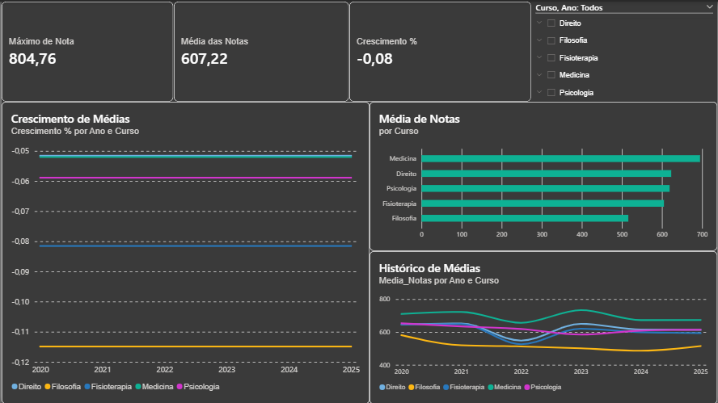

--

#  Dashboard SISU 2020–2025

##  Sobre o Projeto

Projeto de análise de dados desenvolvido no Power BI utilizando notas de corte do SISU entre os anos de 2020 e 2025. A dashboard foi criada para analisar tendências, competitividade dos cursos, modalidades de vaga e evolução das notas ao longo dos anos.

---

# Base de Dados

A base contém informações relacionadas ao SISU, incluindo:

* Ano
* Curso
* Turno
* Modalidade
* Tipo de vaga
* Nota de corte

Os dados foram organizados e estruturados para permitir análises comparativas e temporais.

---

# Tratamento de Dados

Durante o desenvolvimento do projeto foram realizados:

* Limpeza de dados
* Padronização de colunas
* Ajustes de tipos de dados
* Remoção de valores inconsistentes
* Organização das modalidades e turnos

---

# Medidas Criadas

Algumas medidas DAX utilizadas:

```DAX
Media_Notas = AVERAGE(sisu[Nota])

Maior_Nota = MAX(sisu[Nota])
```
---
# Análises

A dashboard apresenta:

* Evolução das notas ao longo dos anos
* Ranking de cursos com maiores notas
* Distribuição das notas
* Tendências de crescimento e redução

---

# Insights

* Cursos da área da saúde apresentaram maiores notas médias.
* A ampla concorrência possui as notas mais elevadas.
* Cursos integrais tendem a apresentar maior competitividade.
* Algumas modalidades tiveram redução da diferença de nota ao longo dos anos.

---

# Objetivo do Projeto

Transformar dados do SISU em informações visuais e estratégicas, facilitando análises sobre competitividade, evolução das notas e comportamento das modalidades de ingresso.

Além disso, o projeto busca desenvolver habilidades em:

* Power BI
* DAX
* Visualização de dados
* Tratamento de dados
* Storytelling com dados

---

# Ferramentas Utilizadas

* Power BI
* Excel
* DAX
* Power Query

# Autores
Desenvolvido por Ana Letícia e Fernanda Pinheiro
---

